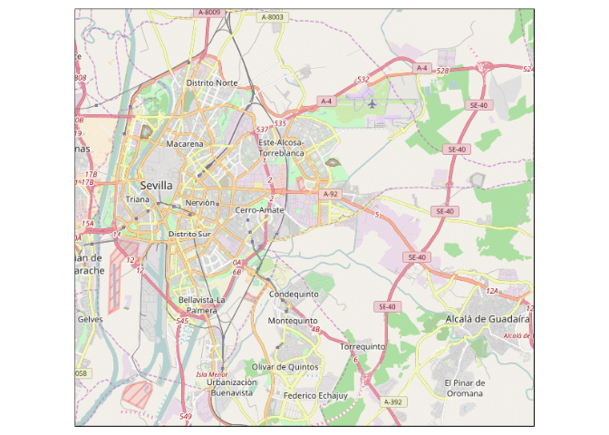
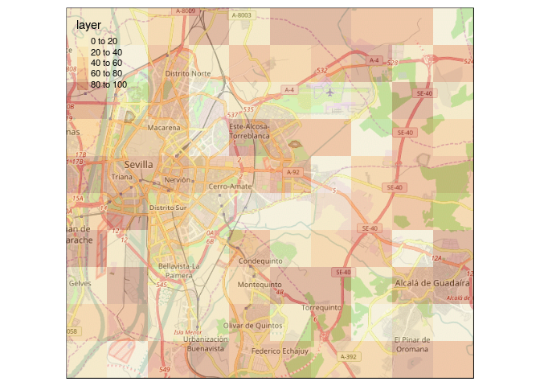
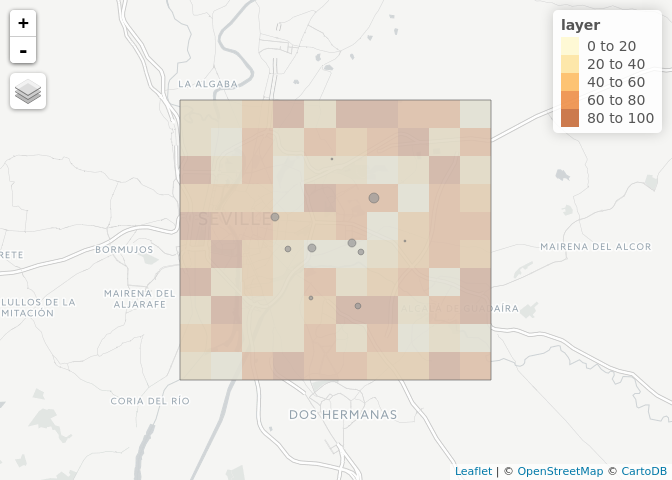
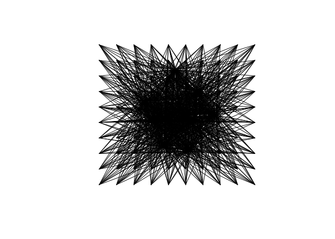
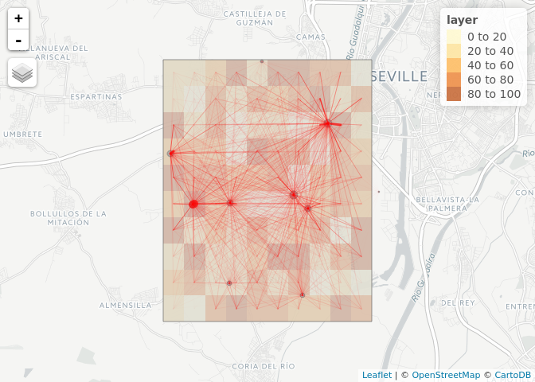

<!-- README.md is generated from README.Rmd. Please edit that file -->
This repository stores code for estimating cycling potential in Seville, Spain. It builds on the Propensity to Cycle Tool (PCT) method deployed for [England](http://www.pct.bike). Although the analysis is localised, the methods are designed to be applicable to other cities. To reproduce the results presented here, you will need to have a recent version of R with the following packages installed:

``` r
library(tmap)
tmap_mode("view")
#> tmap mode set to interactive viewing
library(tmaptools)
library(stplanr)
#> Loading required package: sp
library(rgeos)
#> rgeos version: 0.3-23, (SVN revision 546)
#>  GEOS runtime version: 3.5.1-CAPI-1.9.1 r4246 
#>  Linking to sp version: 1.2-5 
#>  Polygon checking: TRUE
library(raster)
```

Data input
==========

The main data source used by the PCT is origin-destination (OD) data. This can be aquired from many places, including (in roughly descending order of quality):

-   Census of population (see the UK's [Wicid open data portal](http://wicid.ukdataservice.ac.uk/) for an example of this)
-   Travel survey data
-   Mobile telephone company data
-   Modelled data using a spatial interaction model

Each of these has advantages and disadvantages.

There are two main data sources that can be used to model OD-level travel in Seville: official data on population counts, as explained in [a short article](http://rpubs.com/RobinLovelace/209274) and OpenStreetMap (OSM) data. We will start by using randomly generated data to demonstrate the methods. Then we will use OSM data because it is smaller and more generalisable to other cities.

Study region
------------

The first stage is to identify the extent of the city:

``` r
region_bb = bb("Seville")
region_poly = bb2poly(region_bb)
qtm(region_poly)
#> Warning: Currect projection of shape region_poly unknown. Long-lat (WGS84)
#> is assumed.
```



Randomly generated data
-----------------------

Let's split that region into 100 evenly sized areas, and give each cell a random value between 1 and 100:

``` r
r = raster(ext = extent(region_poly), nrows = 10, ncols = 10)
set.seed(1)
values(r) = runif(n = 100, min = 0, max = 100)
(m = qtm(region_poly) +
  tm_shape(r) + tm_raster(alpha = 0.3))
#> Warning: Currect projection of shape region_poly unknown. Long-lat (WGS84)
#> is assumed.
```



Now let's convert those residential zones into centroids:

``` r
o = as(r, "SpatialPointsDataFrame")
o@data = cbind(code_o = 1:nrow(o), o@data)
m +
  qtm(o)
#> Warning: Currect projection of shape region_poly unknown. Long-lat (WGS84)
#> is assumed.
```


Next, let's take 10 destinations at random and allocate attractiveness to them at random:

``` r
region_centre = gCentroid(region_poly)
region_cbuf = buff_geo(region_centre, 5000)
#> Assuming a geographical (lat/lon) CRS (EPSG:4326)
#> Transforming to CRS +proj=aeqd +lat_0=37.37658075 +lon_0=-5.9260377 +x_0=0 +y_0=0 +ellps=WGS84
d = spsample(region_cbuf, n = 10, type = "random")
d = SpatialPointsDataFrame(
  d, data.frame(code_d = 1:length(d), w = runif(n = 10, min = 0, max = 100))
  )
(m = m + qtm(d, symbols.size  = "w"))
#> Warning: Currect projection of shape region_poly unknown. Long-lat (WGS84)
#> is assumed.
#> Legend for symbol sizes not available in view mode.
```



We can estimate the 'flow' (T) between origins (`o`) and destinations (`d`) in many ways. The simplest is a simple gravity model, whereby, for each OD pair:

<p align="center"></p>
 whereby m and n are some measure of size/attractiveness of `o` and `d` respectively. Implementing this in code, we can calculate all the flows as follows:

``` r
T_od = matrix(nrow = nrow(o), ncol = nrow(d))
for(i in 1:nrow(o)) {
  for(j in 1:nrow(d)) {
    T_od[i, j] = o$layer[i] * d$w[j] / geosphere::distHaversine(o[i,], d[j,])
  }
}
head(as.data.frame(table(T_od)))
#>                  T_od Freq
#> 1 0.00105349494541377    1
#> 2 0.00157975938428947    1
#> 3  0.0024946991528917    1
#> 4 0.00312605344873715    1
#> 5 0.00321665236926721    1
#> 6 0.00329837072585195    1
T_odp = as.data.frame.table(T_od)
T_odpVar2 = rep(1:nrow(d), each = nrow(o))
names(T_odp) = c("code_o", "code_d", "Flow")
head(T_odp)
#>   code_o code_d      Flow
#> 1      1      1 0.1039223
#> 2      2      1 0.1630297
#> 3      3      1 0.2806564
#> 4      4      1 0.4928524
#> 5      5      1 0.1184560
#> 6      6      1 0.5492576
```

We can visualise this on the map as follows:

``` r
l = od2line(flow = T_odp, zones = o, destinations = d)
plot(l)
```



On the map of Seville, and with width and opacity proportional to flow, this looks as follows:

``` r
m + tm_shape(l) + tm_lines(lwd = "Flow", scale = 10)
#> Warning: Currect projection of shape region_poly unknown. Long-lat (WGS84)
#> is assumed.
#> Legend for symbol sizes not available in view mode.
#> Legend for line widths not available in view mode.
```



Now we can save this data as an OD matrix:

``` r
write.csv(l@data, "data/od-long-random.csv")
```

Adding OSM data
---------------

From here we can download information on residential areas...

Official data sources
---------------------
