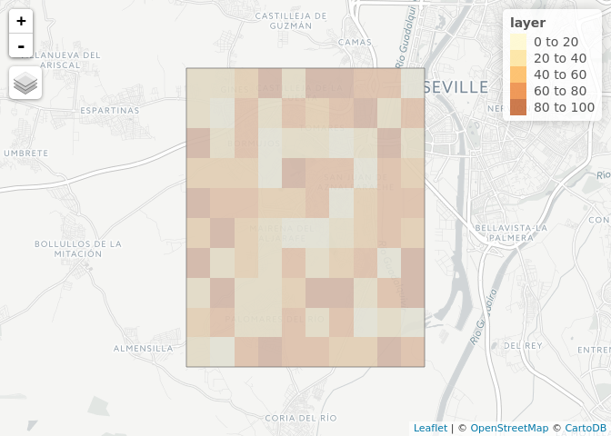

# Context


---

# Problems with current approach

- Focus on cycle paths around central area has a number of **negative** consequences (see below)

- Working hypothesis: these can be tackled by 'Bike `&` Ride' systems

<iframe src="https://www.google.com/maps/embed?pb=!1m0!4v1504009755859!6m8!1m7!1sUyGwvOHX_f03DLL5_i-C3Q!2m2!1d37.34890121392362!2d-6.053344538654443!3f67.05360518924812!4f13.339695262853013!5f0.7820865974627469" width="600" height="450" frameborder="0" style="border:0" allowfullscreen></iframe>

---

# These include:

- Social inequalities: only (on average wealthy) parts of the population benefit
- Spatial inequalilities: rural and suburban areas tend to be neglected by cycling advocacy and policy ([Cooper and Leahy, 2017](http://sci-hub.cc/10.1080/17450101.2016.1254898))
- Cycling tends not to replace cars in the city centre, which has a number of knock-on impacts:
    - Dangerous levels of traffic
    - Air pollution
    - Congestion
    - Political support for driving

- Emphasis on wealthy centres can lead to political 'bikelashes'

---

# PT/cycling integration in context

- Public Transport and associated infrastructure have a range of impacts


---

# What is 'bike & ride'?


---

# Examples of 'bikelash'

- Baltimore: legal proceeding to protect cycle path (source: [citylab](https://www.citylab.com/transportation/2017/07/baltimore-battles-its-bike-lanes/533424/))
- Seattle: "war on cars" meme overcome by 'smart language'
- Waltham Forest, London: bikelash against 'mini Holland' scheme tackled by broadening appeal of cycling advocacy groups


<!--  -->

---

Methods

---

Data input
==========

Needs origin-destination (OD) data, available from many places (in roughly descending order of quality):

-   Census of population (see the UK's [Wicid open data portal](http://wicid.ukdataservice.ac.uk/) for an example of this)
-   Travel survey data
-   Mobile telephone company data
-   Modelled data using a spatial interaction model

> - Each of these has advantages and disadvantages.

---

# Local input data

Two main data sources that can be used to model OD-level travel in Seville: official data on population counts.

- Official data described in [a short article on rpubs.com/robinlovelace](http://rpubs.com/RobinLovelace/209274)
- Sample of this data available in the github repo [robinlovelace/pctSeville](https://github.com/Robinlovelace/pctSeville)
- OpenStreetMap (OSM) data used for station location and (potentially) for estimating travel, via:
     - A spatial interaction including trip generators and 'attractors'
     - Trip attractors: hospitals, schools, shops etc.
     - Trip generators: residential buildings
- But we use sample data to illustrate the methods
- Randomly generated points
- OSM data used because it is smaller and more generalisable

---

Study region
------------


---

Randomly generated data
-----------------------

Let's split that region into 100 evenly sized areas, and give each cell a random value between 1 and 100:

``` r
raster::values(r) = runif(n = 100, min = 0, max = 100)
(m = qtm(region_poly) +
  tm_shape(r) + tm_raster())
```



---

# Converting residential zones to 'centroid' points


``` r
o = as(r, "SpatialPointsDataFrame")
m +
  qtm(o)
```


# Simulating (10) destinations 

``` r
region_centre = rgeos::gCentroid(region_poly)
```


---

# Estimating flow

We can estimate the 'flow' (T) between origins (`o`) and destinations (`d`) in many ways. The simplest is a simple gravity model, whereby, for each OD pair:

$$
T = \\frac{mn}{d^2}
$$
 whereby m and n are some measure of size/attractiveness of `o` and `d` respectively. Implementing this in code, we can calculate all the flows as follows:

``` r
T_od = matrix(nrow = nrow(o), ncol = nrow(d))
for(i in 1:nrow(o)) {
  for(j in 1:nrow(d)) {
    T_od[i, j] = o$layer[i] * d$w[j] / geosphere::distHaversine(o[i,], d[j,])
  }
}
```

---

# Conversion into spatial lines

``` r
l = od2line(flow = T_odp, zones = o, destinations = d)
```

On the map of Seville, and with width and opacity proportional to flow, this looks as follows:


---

Using real data
---------------

From here we will use real data. We use only data on one area initially, and this is saved in the file `data/stations.geojson` ([the vignettes folder](https://github.com/Robinlovelace/pctSeville/blob/master/vignettes/sev-marques-data.Rmd) contains data to reproduce this data) which we load with help from the **sf** library:

``` r
library(dplyr) # for data analysis
#> 
#> Attaching package: 'dplyr'
#> The following objects are masked from 'package:stats':
#> 
#>     filter, lag
#> The following objects are masked from 'package:base':
#> 
#>     intersect, setdiff, setequal, union
library(osmdata) # download data from OSM
#> Data (c) OpenStreetMap contributors, ODbL 1.0. http://www.openstreetmap.org/copyright
```

``` r
# run if online
q = opq(bbox = c(-6.08, 37.32, -6.03, 37.38)) %>% 
  add_osm_feature(key = "railway", value = "station")
stations = osmdata_sf(q)$osm_points
saveRDS(stations, "data/stations.Rds")
```

Official data on cycling is saved in the file `data/pop.geojson`, which can be loaded and visualised as follows:

``` r
stations = readRDS("data/stations.Rds")
pop = read_sf("data/pop.geojson")
pop_cents = read_sf("data/pop_cents.geojson")
qtm(pop, "pob_tot1") + 
  qtm(stations)
```


The routes between each residential origin and its nearest station destination can be calculated as follows:

``` r
pop_cents = filter(pop_cents, pob_tot1 > 100)
od = data.frame(origin = pop_cents$OBJECTID, destination = NA)
for(i in 1:nrow(pop_cents)) {
  for(j in 1:nrow(stations)) {
    od$destination[i] = as.character(stations$osm_id[which.min(st_distance(stations, pop_cents[i,]))])
  }
}
l = od2line(flow = od, zones = as(pop_cents, "Spatial"), destinations = as(stations, "Spatial"))
qtm(l)
```


These can be allocated to the transport network as follows:

``` r
routes = stplanr::line2route(l = l, route_fun = route_graphhopper, vehicle = "bike")
#> 10 % out of 96 distances calculated
#> 21 % out of 96 distances calculated
#> 31 % out of 96 distances calculated
#> 42 % out of 96 distances calculated
#> 52 % out of 96 distances calculated
#> 62 % out of 96 distances calculated
#> 73 % out of 96 distances calculated
#> 83 % out of 96 distances calculated
#> 94 % out of 96 distances calculated
routes$potential = pop_cents$pob_tot1 * 0.556
qtm(routes, lines.lwd = "potential", scale = 10, lines.alpha = 0.5)
#> Legend for line widths not available in view mode.
```


The final stage is to aggregate the values of overlapping lines:

``` r
rnet = overline(routes, "potential")
tm_shape(pop) +
  tm_fill(col = "pob_tot1", n = 4, breaks = c(0, 10, 100, 1000)) +
tm_shape(rnet) +
  tm_lines(lwd = "potential", scale = 20) +
  qtm(stations) +
  tm_scale_bar()
#> Legend for line widths not available in view mode.
```


